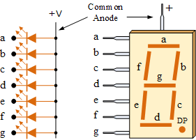
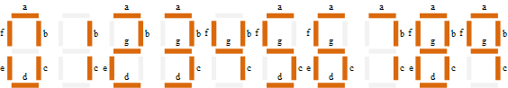
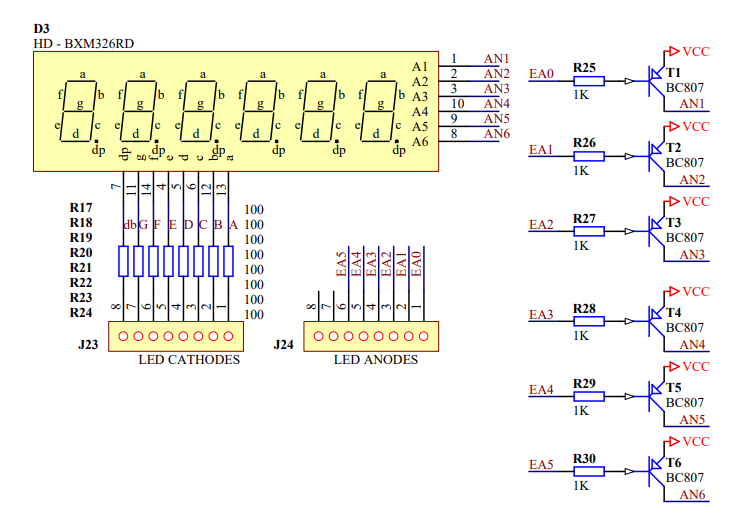
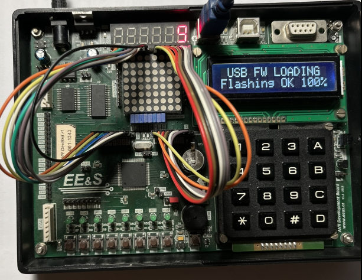

# Sedmisegmentový displej


Sedmisegmentový displej je po LEDkách a tlačítkách další periferie na našem přípravku, se kterou se naučíme pracovat. Je to vcelku jednoduché - sedmisegmentový displej není nic jiného, než LEDky ve tvaru podlouhlých segmentů, které jsou rozestaveny tak, aby se z nich daly skládat číslice.

## Princip funkce
Protože je pro každou pozici displeje těchto LEDek osm (sedm segmentů plus desetinná tečka), můžeme je všechny připojit na jeden port mikroprocesoru a potom jedním zapsáním do registru portu, kde jsou LEDky připojeny nastavíme požadovanou číslici.






*Zdroj obrázků: https://www.electronics-tutorials.ws/blog/7-segment-display-tutorial.html* 

### Zobrazení čísla
Například pokud budeme mít displej připojen k portu B a budeme chtít zapsat nulu. Nula vypadá tak, že svítí všechny segmenty, kromě segmentu g a desetinné tečny (DP). Pokud máme displej se společnou anodou, kde plus je trvale připojeno a segment, který chceme rozsvítit, musíme "přizemnit". Tedy do segmentů které chceme rozsvítit zapíšeme nulu, do těch, které mají zůstat zhasnuté pak jedničku.

|Segment| DP    | g    | f    | e    | d    | c    | b    | a    | 
|:----:|:----:|:----:|:----:|:----:|:----:|:----:|:----:|:----:| 
|**Hodnota bitu**|  **1**| **1**| **0**|  **0** | **0** | **0** | **0** | **0** | 

```C
PORTB = 0b11000000; // Zobrazíme na displeji nulu
```

### Zapojení displeje v našem  přípravku
Sedmisegmentové displeje mohou být buď se společnou katodou (všechny katody jsou spojeny a připojeny k zemi, anody jsou vyvedeny pro každý segment zvlášť) nebo naopak se společnou anodou. Pohledem do schématu našeho přípravku zjistíme, že ten náš je se společnou anodou.



Na přípravku máme celkem šest sedmisegmentových číslic. Jak zobrazovat čísla na různých pozicích najednou, si ukážeme až v některém z dalších cvičení. Pro teď si vystačíme s jednou pozicí, například tou nejvíce vlevo. Ta je napájena anodou AN6. Pomocí Portu D k ní připojíme napětí, zatímco všechny ostatní necháme vypnuté - nulou otevřeme tranzistor, který jí napájí, jedničkou na všech ostatních pozicích ostatní anody vypneme. 

Tranzistory na anodách jsou proto, že pokud by svítilo více segmentů zároveň, celkový proud by přesáhl maximální proud pinu procesoru a ten by se mohl zničit.

```C
PORTD = 0b11011111; // Otevřeme tranzistor, který připojí 5V na anodu AN6 (na přípravku nejvíc vpravo).
```

V našem přípravku není sedmisegmentový displej připojen k procesoru trvale, ale je vyveden na pinovou lištu. Pokud chceme displej používat, musíme ho připojit kablíky viz. obrázek níže.



## Příklad programu
Jednoduchý program, který na jedné pozici sedmisegmentového displeje bude střídavě zobrazovat písmena a,b,c,d,e,f. 

Projděte si jej a zopakujte si
 - K čemu slouží pole, jak se v jazyce C deklaruje a jak z něj získáme konkrétní prvek
 - K čemu slouží a jak se v jazyce C zapisuje for cyklus


```C
#include <avr/io.h>
#define F_CPU 16000000
#include <util/delay.h>

unsigned char znaky[]={0x88, 0x83, 0xc6, 0xA1, 0x86, 0x8e}; // pole kombinací segmentů (a, b, c, d, e, f)
//unsigned char cisla[]={0xc0,0xf9,0xA4,0xb0,0x99,0x92,0x82,0xd8,0x80,0x90,0x88,0x83,0xc6,0xA1,0x86,0x8e};

int main(void)
{	DDRB = 0xff; // Nastaví port B, jako výstup (je připojen k segmentům)
	DDRD = 0xff; // Nastaví port D, jako výstup (je připojen k anodám, řídí, která číslice je aktivní)
	PORTD = 0b11011111; // Otevře tranzistor, který napájí anodu číslice vpravo
	
	while (1)
	{
		for (int i=0;i<6;i++) //cyklus bude zvyšovat proměnnou "i" od 0 do 5
		{
			PORTB=znaky[i];	// Zapíše na displej i-tý prvek z pole
			_delay_ms(500); // Program se na 500ms zastaví, abychom stihli okem vnímat změnu
		}
	}
}
```


## Úkoly:
**1.** Upravte příklad, aby vypisoval čísla 0-9
   
**2.** Upravte příklad, aby vypisoval čísla na jiné pozici displeje

**3.** Upravte příklad, aby počítal pouze 1-5

**4.** Upravte příklad, aby při stisku tlačítka SW0 se zobrazila na displeji nula, při stisku SW1 jednička, atd.


## Další zajímavé zdroje informací
[Sedmisegmentový displej](https://instrumentationtools.com/seven-segment-display-working-principle/)

[Sedmisegmentový displej, multiplex](https://www.electronics-tutorials.ws/blog/7-segment-display-tutorial.html)


### [Zpět na obsah](README.md)
