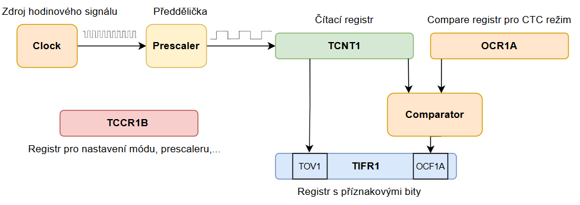
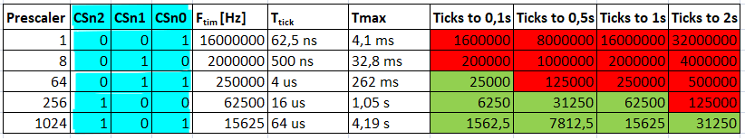
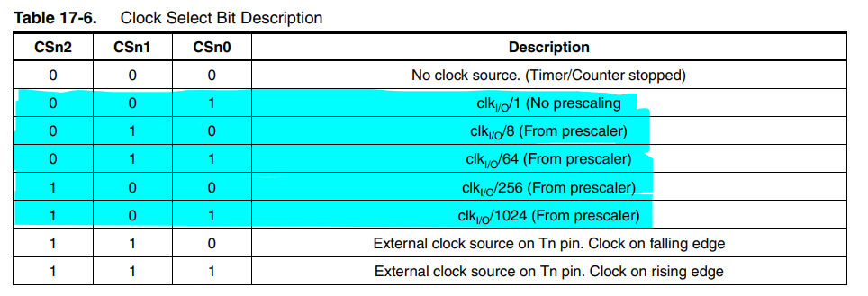
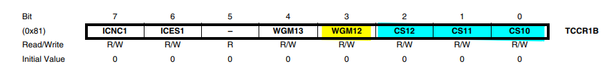
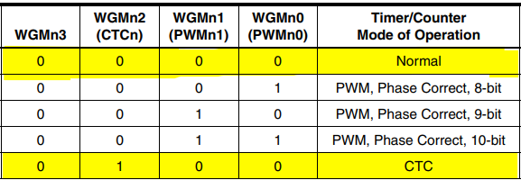
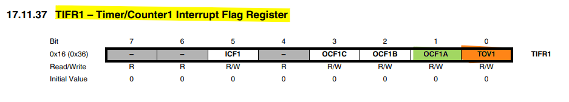
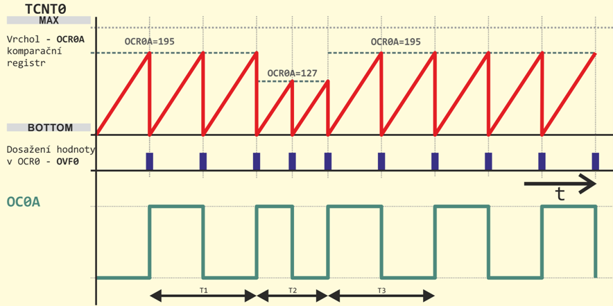
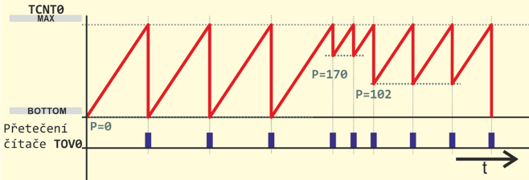

<script type="text/javascript" id="MathJax-script" async 
  src="https://cdn.jsdelivr.net/npm/mathjax@3/es5/tex-svg.js"> 
</script> 

# Časovač

Časovač, anglicky Timer je v mikroprocesorové technice důležitá periferie. Použijeme ho například při generování přesného časového signálu, PWM, měření času, ale i počítání vnějších událostí (např. počtu impulzů z nějakého čidla). Je integrován uvnitř pouzdra mikroprocesoru, ale funguje samostatně, to znamená že po prvotním nastavení počítá sám, i když jádro procesoru dělá něco jiného. Tím pádem je časování přesné a navíc jádro procesoru může dělat něco jiného, nemusí být "zabržděno" v čekacích smyčkách (např. funkce _delay_ms()) .

## Princip časovače, důležité registry

Základní jednotkou časovače je čítací registr, který zvýší svou hodnotu o 1 při každé nástupné hraně hodinového signálu. Pokud dosáhne maximální hodnoty (255 pro 8bitový čítač a 65535 pro 16bitový) při další hraně hodin "přeteče" ->nastaví se opět do 0 a nastaví příznakový bit do 1.



## Časování pro různé hodnoty prescaleru

V pomocné tabulce níže vidíte frekvence a periody časovače pro různé nastavení předděličky kmitočtu. Pomůže vám zvolit správnou hodnotu předděličky pro požadovanou periodu časovače.




## Nastavení časovače

V našem přípravku je zdrojem hodinového signálu krystal s frekvencí 16 MHz, tedy jeden "tick" trvá 1/f = 1/16*10^6 = 62,5ns . Timer1 je 16bitový, tedy maximální hodnota je 65535. Takže k přetečení čítače by došlo za 65536 *  62,5ns = 4,096ms. Pokud chceme aby perioda časovače byla delší (např. chceme blikat s LEDkou jednou za 500ms) můžeme hodinový signál z krystalu vydělit předděličkou (prescaler). Prescaler můžeme změnit zápisem do bitů CSnx v registru TCCR1B viz tabulka.



V registru TCCR1B najdeme můžeme nastavit režim časovače (v této lekci budeme používat Normal mode a CTC mode) a nastavení prescaleru (předděličky hodinového signálu) .



Podle toho, jaký chceme použít režim (mode) časovače, nastavíme jednotlivé bity WGMxx. Pozn. bity  WGM11 a WGM10 v tomto cvičení nastavovat nepotřebujeme, stačí nám je nechat v defaultní hodnotě, což je 0. Pokud bychom chtěli ale zvolit další režimy, najdeme je v registru TCCR1A. 




## Příznakové bity
Hodnota čítače se zvyšuje s každou hranou hodinového signálu. Když dojde až do maxima, při dalším hraně hodin přeteče (overflow) a nastaví se opět do nuly. Při přetečení se nastaví příznakový bit TOV v registru TIFR1. Registr TIFR1 obsahuje i další příznaky, např v tomto cvičení použijeme ještě příznak OCF1A, který se používá v CTC režimu a nastaví se, když se hodnota čítače rovná hodnotě v compare registru OCR1A. 




## Časovač Timer1 v režimu Normal

Zkusme využít časovač pro blikání LEDkami. Použijeme Timer1 v režimu Normal. Čítač spustíme a budeme čekat, až dojde k přetečení (budeme dokola číst bit TOV1). Až dojde k přetečení, musíme příznakový bit ručně vymazat (zapsáním 1). Pak znegujeme stav LEDek na portu F a opět budeme čekat na další přetečení.

```c
#include <avr/io.h>

int main(void)
{
	DDRF = 0xff; // PORTF nastavíme jako výstupní (LEDky)

	TCCR1B = 0b0000011; // Prescaler 64, Normal mode

	while(1)
	{
		while((TIFR1 & (1<<TOV1)) == 0); // Dokud není nastaven bit přetečení časovače, nedělej nic
		
		TIFR1 |= (1<<TOV1); // Vynulování příznakového bitu
		
		PORTF ^= 0xff; // Negace LEDek
	}
}

```

V našem přípravku je použit oscilátor o frekvenci 16MHz a v examplu výše jsme použili předděličku 654. Periodu, tedy čas, za který časovač přeteče spočítáme takto:

$$
\Large f_{\text{timer}} = \frac{f_{\text{osc}}}{Prescaler} = \frac{16MHz}{64} = 250kHz
$$

$$
\Large T_{\text{tick}} = \frac{1}{f_{\text{timer}}} = \frac{1}{250kHz} = 4us
$$

$$
\Large T_{\text{total}} = T_{\text{tick}} \times 2^{bits}  = 4us \times 65536 = 262ms
$$

Kde:

**f<sub>time</sub>**  - frekvence s jakou se inkrementuje časovač

**Prescaler** - zvolená hodnota předděličky (/64, /1024 atd) 

**T<sub>tick</sub>**  - délka jednoho "ticku" časovače - doba za kterou se hodnota čítacího registru zvýší o 1

**T<sub>total</sub>**  - perioda, s jakou časovač přeteče, tj. za jak dlouho projde maximem, nastaví příznakový bit přetečení a začne zase od nuly

**bits** - počet bitů v čítacím registru (Timer0 a Timer2 jsou 8bitové, Timer1 16bitový)

>### 1. Úkol
>Nastavte jinou vybranou hodnotu prescaleru a sledujte jak se změní rychlost blikání LEDek, spočítejte frekvenci blikání a ověřte měřením logickým analyzerem.

## Časovač Timer1 v režimu CTC
Nastavením prescaleru můžeme získat pouze několik málo frekvencí přetečení časovače. Pro jemnější nastavení můžeme použít režim CTC (Clear timer on Compare Match). Funguje tak, že nenecháme časovač počítat od nuly do maxima, ale do registru OCR1A nastavíme novou maximální hodnotu časovače. Když časovač "dopočítá" do této hodnoty (hodnota čítacího registru TCNT1 se bude rovnat hodnotě v compare registru OCR1A) dojde k vynulování čítače a nastavení příznakového bitu shody s komparačním registrem OCF1A. Viz obrázek níže.



Hodnotu pro nastavení registru OCR1 spočítáme podle vzorce:

$$
\Large OCR1A = \frac  {T_{\text{required}}} {T_{\text{tick}}} -1
$$

Kde:

**T<sub>required</sub>**  - požadovaná perioda (čas za který chceme aby časovač přetekl)

**T<sub>tick</sub>**  - délka jednoho "ticku" časovače - doba za kterou se hodnota čítacího registru zvýší o 1

**-1** - k přetečení a nastavení příznakového bitu dojde až při další hraně hodinového signálu, proto aby perioda byla přesná, musíme hodnotu ještě snížit o jedničku

>### 2. Úkol 
>Nastavte časovač pomocí CTC režimu, aby došlo k přetečení každých 500ms. Nezapomeňte nastavit CTC režim v registru TCCR1B a dosažení požadované hodnoty kontrolovat čtením bitu OCF1A.

<!---
## Změna frekvence časovače pomocí přednastavení časovače (preload)

Pokud z nějakého důvodu nechceme nebo nemůžeme použít CTC režim (např. používáme procesor, jehož čítač CTC režium neumí), můžeme změnit frekvenci časovače tím, že nebude začínat od nuly, ale od vyšší hodnoty.



Hodnotu pro přednsastavení registru TCNT spočítáme tak, že od maximální hodnoty čítače (255 pro 8bitový čítač a 65535 pro 16bitový) odečteme takový počet ticků, který odpovídá požadované periodě.

Tedy např. pro periodu 100ms a prescaler 64:

$$
\Large f_{\text{timer}} = \frac{f_{\text{osc}}}{Prescaler} = \frac{16MHz}{64} = 250kHz
$$

$$
\Large T_{\text{tick}} = \frac{1}{f_{\text{timer}}} = \frac{1}{250kHz} = 4us
$$

$$
\Large TCNT1 = 2^{bits} - \frac {T_{\text{required}}} {T_{\text{tick}}} = 65536 - \frac {100ms} {4us} = 40 536
$$

Kde:

**f<sub>time</sub>**  - frekvence s jakou se inkrementuje časovač

**Prescaler** - zvolená hodnota předděličky (/64, /1024 atd) 

**T<sub>tick</sub>**  - délka jednoho "ticku" časovače - doba za kterou se hodnota čítacího registru zvýší o 1

**TCNT1**  - hodnota, kterou přednastavíme do registru TCNT1 po každém přetečení (aby nezačínal počítat on nuly, ale od této hodnoty)

**bits** - počet bitů v čítacím registru (Timer0 a Timer2 jsou 8bitové, Timer1 16bitový)


Narozdíl od CTC režimu, zde musíme do registru TCNT pokaždé, když timer přeteče, nastavit opět ručně vypočítanou hodnotu.

>### 3. Úkol
>Nastavte časovač do Normal režimu s přednastavením do TCNT aby došlo k přetečení každé 2s.
--->

## Další užitečné zdroje informací

[Časovač](https://www.electronicwings.com/avr-atmega/atmega1632-timer)

[Další časovač](https://bennthomsen.wordpress.com/arduino/peripherals/timers/)

[Všechny módy časovače](https://fabacademy.org/2015/eu/students/gunnarsson.thorarinn_b.b/docs/d7/Timers.pdf)

### [Zpět na obsah](README.md)
