# Datová komunikace, UART
Pokud potřebujeme, aby si mikroprocesor vyměňoval data s jinými součástkami nebo mikroprocesory, existuje mnoho typů komunikace, které můžeme použít. Liší se rychlostí, počtem použitých vodičů, odolností proti rušení atd. Často používanými komunikačními sběrnicemi jsou [UART, SPI a I2C](https://www.hibit.dev/posts/102/communication-protocols-uart-i2c-and-spi). My se v dnešním cvičení budeme věnovat UARTu, ale předtím si ukážeme základní typy dělení komunikačních sběrnic a protokolů.

## Komunikace sériová vs paralelní
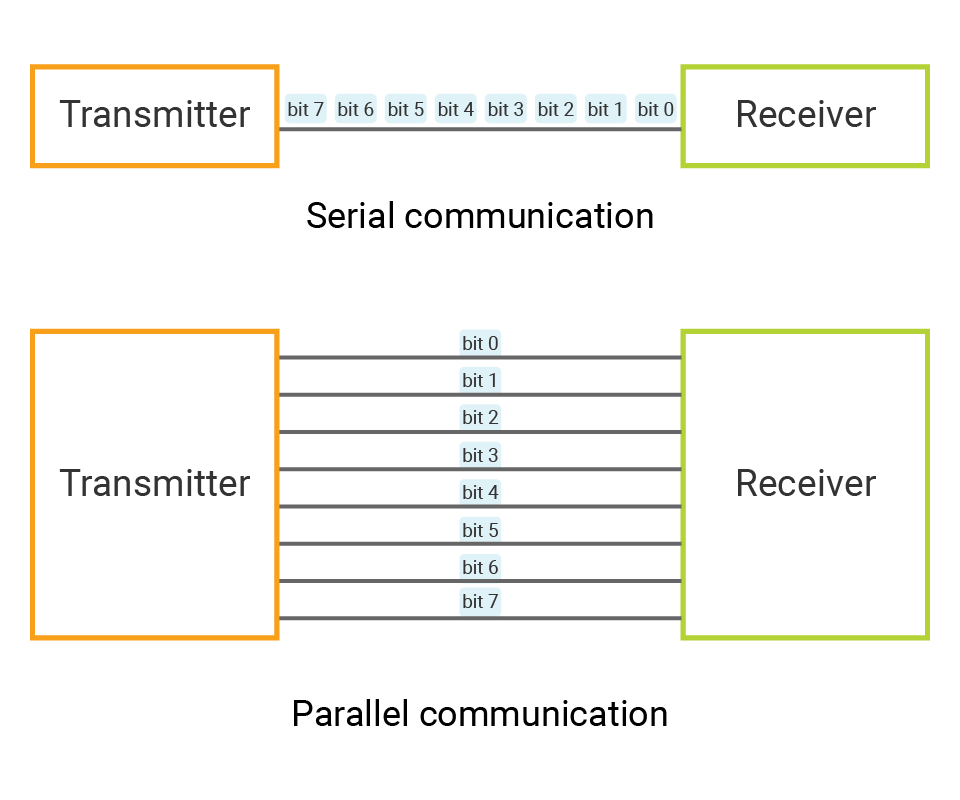

## Komunikace synchronní vs asynchronní
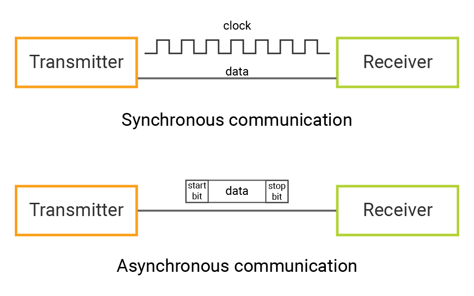

*Zdroj obrázku: https://docs.madmachine.io/learn/advanced/uart*

## Komunikace podle směru přenosu dat
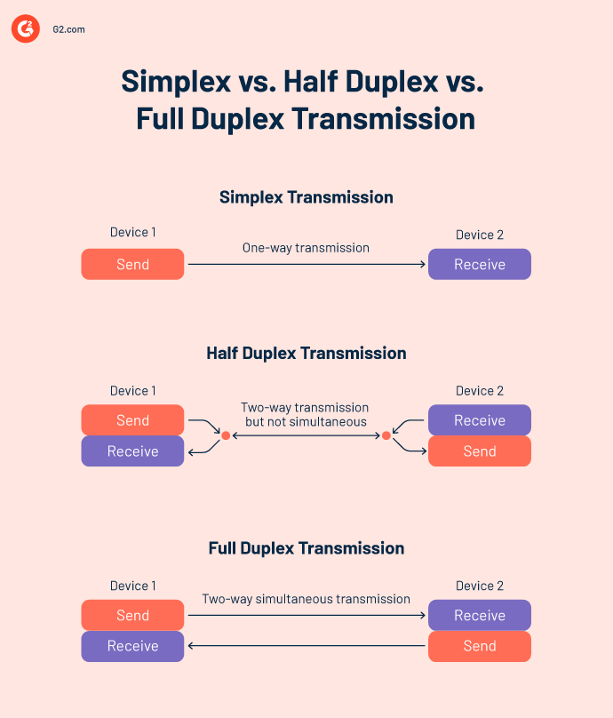

*Zdroj obrázku: http://www.lboptic.com/index.php?m=content&c=index&a=show&catid=20&id=10*


## UART 
UART (Universal Asynchronous Receiver / Transmitter)  definuje protokol neboli sadu pravidel pro výměnu sériových dat mezi dvěma zařízeními. UART je velmi jednoduchý a používá pouze dva vodiče mezi vysílačem a přijímačem pro obousměrný přenos. Oba konce musí mít také společné uzemnění (GND).

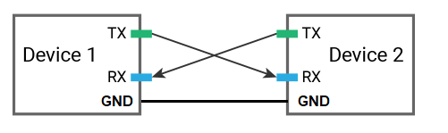

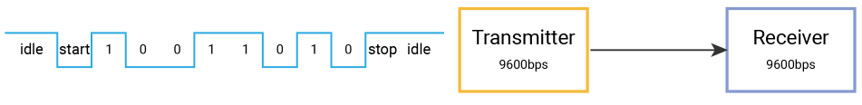

*Zdroj obrázku: https://docs.madmachine.io/learn/advanced/uart*

## Zapojení v přípravku
Mikrokontroler ATmega 2560 má celkem 4 USART periferie. Dvě z nich jsou připojeny k převodníku na USB. Abychom nemuseli připojovat další kabel, budeme používat stejný USART jako pro programování. Podle schématu je to USART1, který je připojen k pinům D2 (RXD1) a D3 (TXD1). Proto i všechny registry, které budeme nastavovat, budou mít index 1 (UDR1, UCSR1A, atd.)

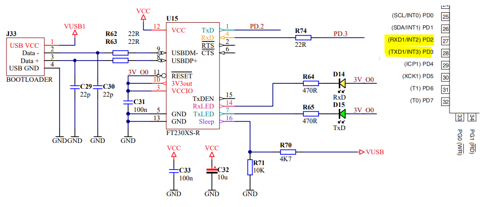

## Důležité registry
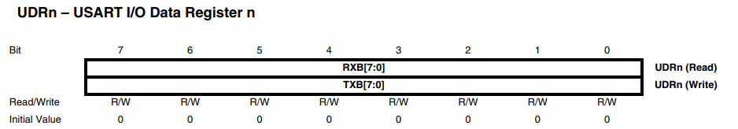

Datový registr, kam ukládáme bajt, který chceme odeslat, popřípadě z něj čteme přijatý bajt. Ve skutečnosti jsou to dva registry, jeden pro vysílání, druhý pro příjem, ale používají jedno označení.

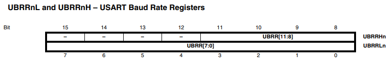

USART Baud Rate Register, 16 bitový registr pro nastavení rychlosti přenosu (baudrate).

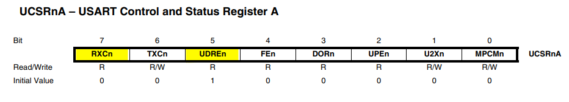

**UDREn**: USART Data Register Empty- Nastaví se automaticky do jedničky, když se předchozí bajt odeslal a můžeme tak do registru UDRn zapsat další bajt k odeslání

**RXCn**: USART Receive Complete - tento bit se automaticky nastaví do jedničky, když je přijat nový bajt

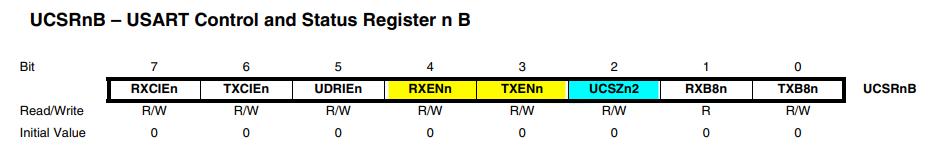

**RXENn**: Receiver Enable - Zápisem jedničky se aktivuje příjem

**TXENn**: Transmitter Enable - Zápisem jedničky se aktivuje vysílání

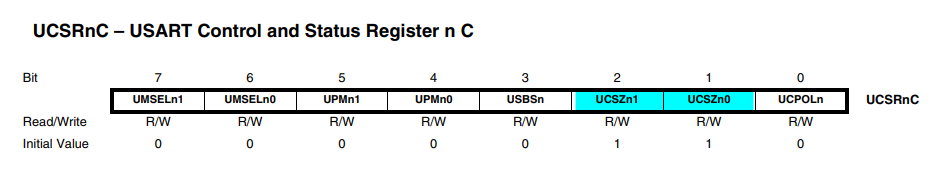

**UCSZn1:0**: Kombinace bitů UCSZn1:0 a bitu UCSZn2 v registru UCSRnB nastavuje počet datových bitů (Character Size) v jednom datovém rámci

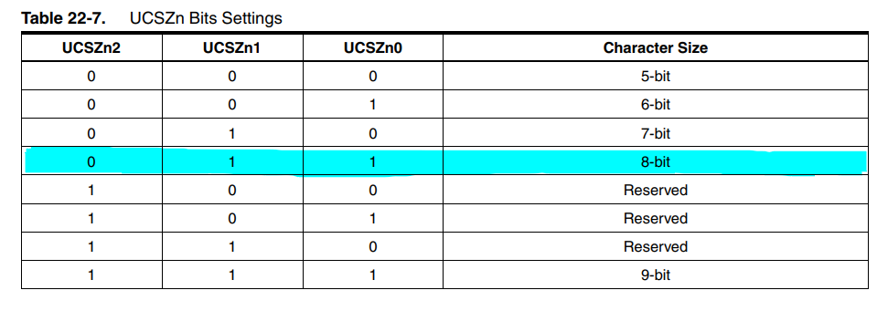


## Přidání pluginu Terminal do Microchip Studia
Abychom mohli data, která z procesoru odesíláme přes UART zobrazit v počítači, potřebujeme k tomu vhodný program. Mohli bychom použít Serial Monitor v Arduino IDE, ale lepší možnost je doinstalovat do Microchip Studia plugin Terminal. Pokud ho v Microchip Studiu ještě nemáte, postupujte podle návodu:

**1.** Stáhněte si plugin [Terminal for Atmel Studio](https://gallery.microchip.com/api/v2/package/EFC4C002-63A3-4BB9-981F-0C1ACAF81E03/2.8.4)

**2.** Otevřete instalační soubor pomocí programu Microsoft Visual Studio Version selector
    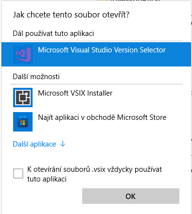

**3.** Zavřete a znovu spusťte Microchip Studio

**4.** V menu View byste měli mít volbu Terminal

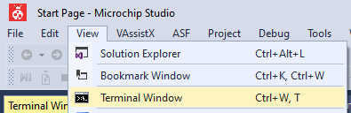


## Použití UARTu

```c
#include <avr/io.h>
#include <avr/interrupt.h>
#define F_CPU 16000000
#include <util/delay.h>
#include <stdio.h>

#define BAUDRATE 9600
#define BAUD_PRESCALER (((F_CPU / (BAUDRATE * 16UL))) - 1)

// Funkce pro inicializaci UART perferie
void UART_init()
{
	UBRR1 = BAUD_PRESCALER; // Nastavit předděličku pro požadovaný baudrate
	UCSR1C = ((1 << UCSZ11)|(1<<UCSZ10));   // 8 datových bitů, žádná parita, 1 stop bit
	UCSR1B = ((1<<RXEN1)|(1<<TXEN1));       // Povolit příjem a vysílání
}

//Funkce pro odeslání jednoho znaku
void UART_send( unsigned char data)
{
// Doplňte kód
}

// Funkce pro příjem jednoho znaku
unsigned char UART_receive( void )
{
// Doplňte kód
}

// Funkce pro odeslání řetězce znaků
void UART_putstring(char* StringPtr)
{
    while(*StringPtr != 0x00)
    {
        UART_send(*StringPtr);
        StringPtr++;
    }
}


// Hlavní program
int main(void)
{
	UART_init();

	while (1) 
	{
	}
}
```


## Úkoly
**1.** Doplňte implementaci funkcí pro odeslání a příjem znaku


**2.** Pomocí funkce UART_send() posílejte střídavě každou sekundu znaky 'a' a 'b'. Přijatá data zobrazte v okně Terminal v Microchip Studiu.

**3.** Pošlete pomocí funkce UART_putstring() textový řetězec. Data přijímejte v Microchip studiu v Terminal window.

**4.** Pomocí funkce UART_receive() přijímejte jeden bajt z počítače. Pokaždé když procesor přijme bajt, zapíše jeho hodnotu na PORT F a tím ho zobrazí na LEDkách. Nezapomeňte nastavit PORTF jako výstup. Přepněte si v okně Terminal posílání HEX namísto ASCII.

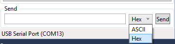

**5.** Propojte dva přípravky přes UART. V jednom ponechte program z bodu 4. - tedy aby zapínal LEDky podle hodnoty bajtu, který přijme přes UART. Druhý přípravek naprogramujte tak, aby např. každou sekundu posílal přes UART různá data a tím blikal LEDkami na druhém přípravku. Propojte Tx a Rx do kříže a propojte zem (GND) obou přípravků. Piny Rx1 a Tx1 najdete na přípravku s pomocí schématu výše.

**6.** Rozšiřte program z příkladu 5. tak, aby se po stisku klávesy na jednom přípravku odeslalo číslo stisknuté klávesy přes UART. Druhý přípravek opět tuto informaci přijme a zobrazí ji pomocí LEDek. Obsluhu klávesnice najdete  [zde](06_Klavesnice.md)

**7.** Propojte dva přípravky přes UART a naprogramujte "UART ping pong" - přípravek vždy přjme bajt z UARTu, navýší ho o jedničku a zase jej odešle přes UART do druhého přípravku. Sledujte komunikaci pomocí logického analyzeru.


## Další užitečné zdroje informací
[UART Tutorial](https://www.electronicwings.com/avr-atmega/atmega1632-usart)

[Video UART a digitální komunikace](https://www.youtube.com/watch?feature=shared&v=Af6wO4QX28E)

[Další UART Tutorial](https://learn.sparkfun.com/tutorials/serial-communication)


### [Zpět na obsah](README.md)
