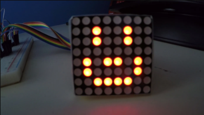
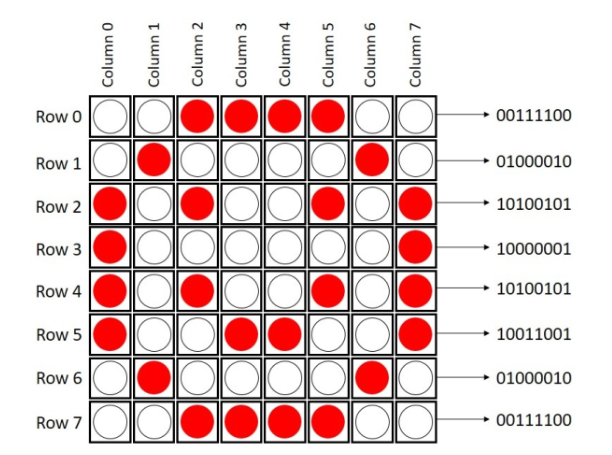
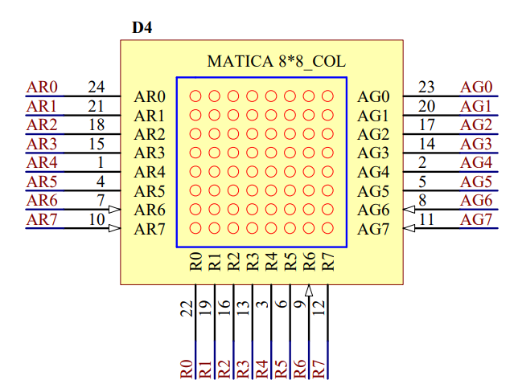
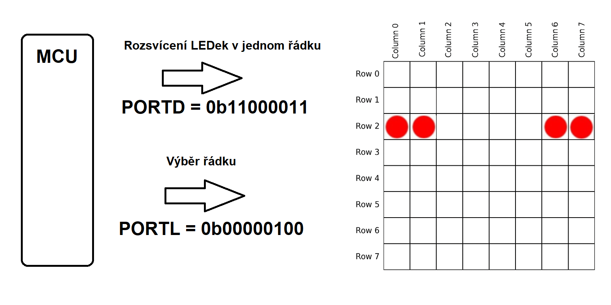

# Maticový displej
Další z periferií, kterou se naučíme ovládat mikrokontrolerem je maticový displej 8x8. Je tvořen maticí LEDek a dokáže zobrazovat jak text, tak jednoduchou grafiku.



## Princip funkce

Maticový displej má 8x8 bodů. Pokud bychom chtěli každý bod řídit jedním pinem, potřebovali bychom jich 64, což je příliš mnoho, některé mikroprocesory ani tolik pinů nemají. Používá se tedy stejná technika, jakou jsme si už ukázali u sedmisegmentového displeje - **časový multiplex**.

Multiplexování u 8x8 maticového displeje funguje tak, že se v jeden okamžik rozsvítí **jen jeden řádek**. Řádky se postupně střídají rychlostí, kterou lidské oko nevnímá, například 100Hz.

Zapneme první řádek a rozsvítíme jen ty LEDky, které mají v daném řádku svítit. Pak přepneme na druhý řádek, a tak dál až k osmému.  Po zobrazení všech řádků se proces opakuje znovu a znovu. Čím rychleji cyklus běží, tím plynuleji obraz vypadá. Díky **setrvačnosti lidského oka** se to ale jeví jako by svítily všechny řádky zároveň.



*Zdroj obrázku: https://randomnerdtutorials.com/guide-for-8x8-dot-matrix-max7219-with-arduino-pong-game/*


## Zapojení v přípravku
Když se podíváme na maticový displej ve schématu naší výukové desky, vypadá to takto:

Piny **R0** až **R7** znamenají **R**ow 0-7. Jsou na přípravku připojeny na P**ORTL**.

Piny **AR0** až **AR7** znamenají **A**node **R**ed 0-7. Na přípravku jsou vyvedeny na pinovou lištu, můžeme **pomocí plochých kabelů připojit k libovolným volným portům** na přípravku (např. PORTA, PORTJ, PORTB,PORTD).

Piny **AG0** až **AG7** znamenají **A**node **G**reen 0-7 **pomocí plochých kabelů připojit k libovolným volným portům** na přípravku (např. PORTA, PORTJ, PORTB,PORTD)

Vidíme, že každý bod displeje je tvořen dvěma LEDkami - červenou a zelenou. Můžeme tedy rozsvítit jednu z nich, žádnou nebo obě.



Pokud například použijeme pro řízení sloupců port D, může řízení displeje vypadat třeba takto:




## Úkoly
**1.** Napište program, který rozsvítí na maticovém displeji všechny čtyři rohové body.

**2.** Vymyslete si vlastní obrázek 8x8 pixelů (smajlík, srdce, kočka,...) a sestavte si pole s hodnotami pro každý řádek displeje.
   ```c
   char zobraz[] = {
   	0b00111100,  //   ████
   	0b01000010,  //  █    █
   	0b10100101,  // █ █  █ █
   	0b10000001,  // █      █
   	0b10100101,  // █ █  █ █
   	0b10011001,  // █  ██  █
   	0b01000010,  //  █    █
   	0b00111100   //   ████
   };
   ```
**3.** Zobrazte obrázek na displeji bez použití časovače, pouze s  použitím cyklu for a funkce _delay_ms().

**4.** Zobrazte obrázek pomocí přerušení časovače - vykreslení se bude vykonávat v obsluze přerušení (funkce ```ISR(TIMER1_COMPA_vect){}```) hlavní smyčka programu zůstane volná. Časovač můžete nastavit například takto:
   ```c
   TIMSK1 = 0x02; // Povolení přerušení při shodě čítače s komparačním registrem OCR1A
   sei(); // Globální povolení přerušení
   TCCR1B = 0b0001100; // CTC režim, dělička 256 -> Ttick = 16us
   
   OCR1A = ???; // Dopočítejte počet ticků do přerušení (1 tick = 16us)
   ```
**5.** Nadefinujte si druhý obrázek a napište program tak, aby se oba obrázky po dvou sekundách střídaly. V hlavní smyčce provádějte změnu obrázků, samotné zobrazování ponechte v obsluze přerušení časovače.

**6.** Vytvořte program, který zobrazuje text, písmeno po písmenu. Hodnoty k vykreslení jednotlivých písmen můžete použít ze souboru [Font_8x8.h](/files/Font_8x8.h).

**7.** Napište program tak, aby po stisku tlačítka změnil barvu obrázku na displeji z červené na zelenou.

### [Zpět na obsah](README.md)
